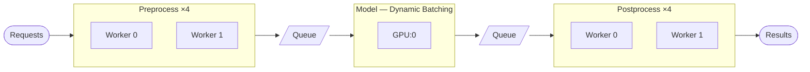

# Conveyor

Streaming inference pipeline with **stage-level parallelism** and **dynamic batching**. Stages run concurrently via async queues — while request A is in the model stage, request B is already preprocessing.



### Why it's fast

```mermaid
gantt
    title Sequential vs Conveyor — 3 requests
    dateFormat x
    axisFormat %L ms

    section Sequential
    Pre A   :s1, 0, 20
    Model A :s2, 20, 70
    Post A  :s3, 70, 90
    Pre B   :s4, 90, 110
    Model B :s5, 110, 160
    Post B  :s6, 160, 180
    Pre C   :s7, 180, 200
    Model C :s8, 200, 250
    Post C  :s9, 250, 270

    section Conveyor
    Pre A   :c1, 0, 20
    Pre B   :c2, 0, 20
    Pre C   :c3, 0, 20
    Model A+B :c4, 20, 70
    Post A  :c5, 70, 90
    Post B  :c6, 70, 90
    Model C :c7, 70, 120
    Post C  :c8, 120, 140
```



> Stages overlap — GPU never waits for CPU for pre/post processing. With 2 GPUs, throughput scales linearly.

## Installations

```bash
pip install conveyor

# with FastAPI server support
pip install conveyor[server]
```

## Quick start

```python
import asyncio
from conveyor import Pipeline, Stage, BatchStage, StageConfig, BatchConfig

async def preprocess(data: str) -> str:
    return data.upper()

async def model_infer(batch: list[str]) -> list[str]:
    return [f"[result:{x}]" for x in batch]

async def postprocess(data: str) -> str:
    return f"done:{data}"

pipeline = Pipeline(stages=[
    Stage(preprocess, StageConfig(workers=4, stage_name="pre")),
    BatchStage(model_infer, BatchConfig(max_batch_size=8, timeout_s=0.05)),
    Stage(postprocess, StageConfig(workers=4, stage_name="post")),
])

async def main():
    async with pipeline:
        results = await asyncio.gather(*[pipeline.submit(f"req-{i}") for i in range(20)])
        print(results)

asyncio.run(main())
```
* re-write the `preprocess`, `model_infer`, `postprocess` your own; `data`, `batch` can be at any type.

## Multi-GPU

For more than 1 GPU, use `from_factory` to create inference function for each:

```python
def load_model() -> torch.nn.Module:
    return torch.nn.Module() # just an example

def make_model(device_id: int):
    model = load_model().to(f"cuda:{device_id}")

    async def infer(batch: list) -> list:
        return await asyncio.to_thread(model, batch) # avoid blocking io

    return infer

model_stage = BatchStage.from_factory(
    fn_factory=make_model,
    device_ids=[0, 1, 2, 3], # load model on cuda 0, 1, 2, 3
    batch_config=BatchConfig(max_batch_size=16, timeout_s=0.05),
    stage_config=StageConfig(stage_name="model"),
)

# then initialize the pipeline as in the quickstart section
pipeline = Pipeline(stages=[
    Stage(preprocess, StageConfig(workers=4, stage_name="pre")),
    model_stage,
    Stage(postprocess, StageConfig(workers=4, stage_name="post")),
])
```
<!-- 
## Progress tracking

Long-running stages (e.g. diffusion) can report step progress:

```python
async def denoise(batch: list, progress=None) -> list:
    for step in range(100):
        batch = do_step(batch, step)

        if progress: # optional; this feature is useful to accurately setting up scheduling 
            progress(step + 1, 100)

    return batch
```

Inspect live progress via `pipeline.report()` or the `/report` endpoint. 
-->

## Serve over HTTP

```python
from conveyor.server import create_app

app = create_app(pipeline, prefix="/model")
# uvicorn myapp:app
```

## Benchmark

Stable Diffusion v1.5 (float16, 30 steps, 512x512) on a single RTX 4060 — 10 images generated concurrently:

| Mode | Total time | Avg per request | Speedup |
|---|---|---|---|
| **Conveyor pipeline** | **47.32s** | **4.73s** | **1.48x** |
| Sequential | 70.14s | 7.01s | 1.0x |

The GPU never waits for save/upload — while image N is uploading, image N+1 is already denoising. See full details in [`benchmark.md`](benchmark.md).

## Examples

| Example | Description |
|---|---|
| [`quickstart.py`](examples/quickstart.py) | Minimal pipeline, no GPU needed |
| [`yolo_detection.py`](examples/yolo_detection.py) | YOLO object detection with batching |
| [`stable_diffusion_t2i.py`](examples/stable_diffusion_t2i.py) | Image generation pipeline |
| [`stable_diffusion_i2i.py`](examples/stable_diffusion_i2i.py) | Image editing pipeline |

## License

MIT

*(images under `examples/images` are collected from [CelebA dataset](https://www.kaggle.com/datasets/jessicali9530/celeba-dataset), and just used for demo purposes)*
