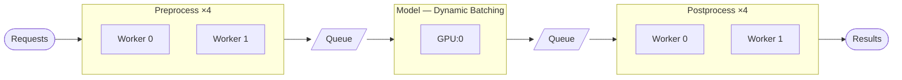

# Conveyor

Streaming inference pipeline with **stage-level parallelism** and **dynamic batching**. Stages run concurrently via async queues — while request A is in the model stage, request B is already preprocessing.


```mermaid
flowchart LR
    Input([Requests]) --> pre

    subgraph pre ["Preprocess ×4"]
        direction TB
        Pre0[Worker 0]
        Pre1[Worker 1]
    end

    pre --> Q1[/Queue/] --> model

    subgraph model ["Model — Dynamic Batching"]
        direction TB
        GPU0["GPU:0"]
    end

    model --> Q2[/Queue/] --> post

    subgraph post ["Postprocess ×4"]
        direction TB
        Post0[Worker 0]
        Post1[Worker 1]
    end

    post --> Output([Results])
```

### Why it's fast


```mermaid
gantt
    title Sequential vs Conveyor — 3 requests
    dateFormat x
    axisFormat %L ms

    section Sequential
    Pre A   :s1, 0, 20
    Model A :s2, 20, 70
    Post A  :s3, 70, 90
    Pre B   :s4, 90, 110
    Model B :s5, 110, 160
    Post B  :s6, 160, 180
    Pre C   :s7, 180, 200
    Model C :s8, 200, 250
    Post C  :s9, 250, 270

    section Conveyor
    Pre A   :c1, 0, 20
    Pre B   :c2, 0, 20
    Pre C   :c3, 0, 20
    Model A+B :c4, 20, 70
    Post A  :c5, 70, 90
    Post B  :c6, 70, 90
    Model C :c7, 70, 120
    Post C  :c8, 120, 140
```

> Stages overlap — GPU never waits for CPU for pre/post processing. With 2 GPUs, throughput scales linearly.

## Installation

```bash
pip install conveyor
```

## Quick start

A stage takes a **list of functions** — one per concurrent worker. Sync functions run on a shared thread pool; coroutines run on the event loop.

```python
import asyncio
from conveyor import Pipeline, Stage, BatchStage

async def preprocess(data: str) -> str:
    return data.upper()

async def model_infer(batch: list[str]) -> list[str]:
    return [f"[result:{x}]" for x in batch]

async def postprocess(data: str) -> str:
    return f"done:{data}"

pipeline = Pipeline(stages=[
    Stage([preprocess] * 4, max_qsize=512, stage_name="pre"),
    BatchStage(
        [model_infer],
        max_qsize=128,
        max_batch_size=8,
        timeout_s=0.05,
        stage_name="model",
    ),
    Stage([postprocess] * 4, max_qsize=512, stage_name="post"),
])

async def main():
    async with pipeline:
        results = await asyncio.gather(*[pipeline.submit(f"req-{i}") for i in range(20)])
        print(results)

asyncio.run(main())
```

Bring your own `preprocess`, `model_infer`, `postprocess` — `data` and `batch` can be any type.

## Multi-GPU

Build one worker function per GPU with a factory, then pass them as a list. Each worker keeps its own model bound to its own device:

```python
import asyncio
import torch

def make_model(device_id: int):
    model = load_model().to(f"cuda:{device_id}")

    async def infer(batch: list) -> list:
        # offload the blocking GPU call so other stages keep running
        return await asyncio.to_thread(model, batch)

    return infer

model_stage = BatchStage(
    fns=[make_model(d) for d in [0, 1, 2, 3]],  # one worker per GPU
    max_qsize=64,
    max_batch_size=16,
    timeout_s=0.05,
    stage_name="model",
)

pipeline = Pipeline(stages=[
    Stage([preprocess] * 4, max_qsize=512, stage_name="pre"),
    model_stage,
    Stage([postprocess] * 4, max_qsize=512, stage_name="post"),
])
```

The same pattern works with plain `Stage` when you don't need batching — see [`examples/stable_diffusion_t2i.py`](examples/stable_diffusion_t2i.py).

## Serve over HTTP

Conveyor is framework-agnostic — `pipeline.submit` is the only thing a handler needs:

```python
from contextlib import asynccontextmanager
from fastapi import FastAPI

@asynccontextmanager
async def lifespan(app: FastAPI):
    async with pipeline:
        yield

app = FastAPI(lifespan=lifespan)

@app.post("/infer")
async def infer(payload: dict):
    return await pipeline.submit(payload)
```

Check pipeline health with `await pipeline.report()` — returns per-stage queue depth, worker count, and utilization.

## Metrics

Install with the `metrics` extra to expose Prometheus counters and histograms (labels: `pipeline`, `stage`, `status`):

```bash
pip install "conveyor[metrics]"
```

- `conveyor_items_total` — throughput and error rate
- `conveyor_processing_duration_seconds` — latency histogram

Without `prometheus_client` installed, every recording call is a silent no-op.

## Benchmark

Stable Diffusion v1.5 (float16, 30 steps, 512x512) on a single RTX 4060 — 10 images generated concurrently:

| Mode | Total time | Avg per request | Speedup |
|---|---|---|---|
| **Conveyor pipeline** | **47.32s** | **4.73s** | **1.48x** |
| Sequential | 70.14s | 7.01s | 1.0x |

The GPU never waits for save/upload — while image N is uploading, image N+1 is already denoising. See full details in [`benchmark.md`](benchmark.md).

## Examples

| Example | Description |
|---|---|
| [`quickstart.py`](examples/quickstart.py) | Minimal 3-stage pipeline, no GPU needed |
| [`stable_diffusion_t2i.py`](examples/stable_diffusion_t2i.py) | Text-to-image with multi-GPU pattern |
| [`stable_diffusion_i2i.py`](examples/stable_diffusion_i2i.py) | Image-to-image editing pipeline |
| [`light_on_ocr_pipeline.py`](examples/light_on_ocr_pipeline.py) | OCR with the LightOnOCR-2-1B model |

## License

MIT

*(images under `examples/images` are collected from the [CelebA dataset](https://www.kaggle.com/datasets/jessicali9530/celeba-dataset), used for demo purposes only)*
